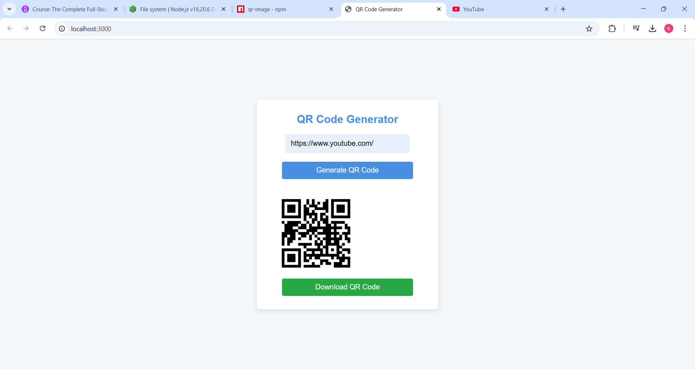

# 🔗 QR Code Generator

A simple and interactive **QR Code Generator** built using **Node.js** and **Express**. This web app allows users to input any URL and instantly generate a scannable QR code image. The QR code is downloadable, and the URL is saved for later reference.

## 🚀 Live Demo
🔗 [Try the QR Code Generator](https://node-js-qr-code-generator.onrender.com/) 

## 📸 Screenshot


## 📜 Project Overview

This project is a basic **QR Code Generator** where users can:
1. **Input a URL** via a simple web interface.
2. **Generate a QR Code** for the provided URL.
3. **Download the QR Code** as a PNG image for use in various applications.

The app is powered by **Node.js** for the backend, **Express** for the server-side framework, and the **qr-image** library for generating the QR codes. Additionally, the app stores the entered URL in a text file (`URL.txt`) for easy access.

### Key Features
- **Simple Input**: Users can easily input any URL via a web form.
- **Dynamic QR Code Generation**: The app generates a unique QR code based on the entered URL.
- **Download Option**: The QR code can be downloaded as a PNG file, making it accessible for offline use.
- **URL Storage**: The URL input is saved to a text file, allowing users to refer to it later.

## 🛠 Technologies Used
- **Node.js**: JavaScript runtime used to run the server and backend.
- **Express**: Lightweight web framework for building the server and handling routes.
- **qr-image**: A library that converts URLs into QR codes.
- **Inquirer**: Command-line library for getting input (if you're running it via terminal).
- **File System (fs)**: Node.js' `fs` module used to store the entered URL in a file.

## 📂 Project Setup

### 1. Clone the Repository

To get started, first clone the repository to your local machine:

```bash
git clone https://github.com/yourusername/qr-code-generator.git
cd qr-code-generator
